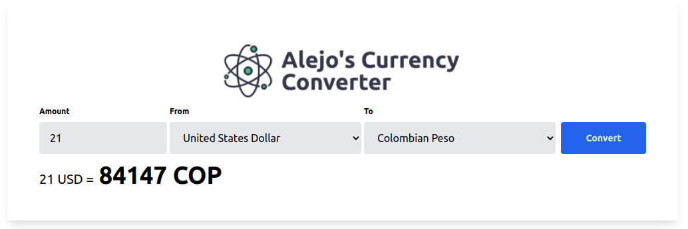

<!-- PROJECT LOGO -->
<br />
<p align="center">
    

  <h3 align="center">Alejo's Currency Converter</h3>

  <p align="center">
    Currency Converter App
    <br />
    <br />
    <a href="https://currency.asilvabe.dev">Live Demo</a>
  </p>
</p>

<!-- TABLE OF CONTENTS -->
## Table of Contents

* [About the Project](#about-the-project)
  * [Built With](#built-with)
* [Installation](#installation)
* [Usage](#usage)
* [Contributing](#contributing)
* [License](#license)
* [Contact](#contact)

<!-- ABOUT THE PROJECT -->
## About The Project

This is a simple project that allows you to convert currencies by consuming an API for this purpose.

### Built With
* [Tailwind](https://tailwindcss.com/)
* [Laravel](https://laravel.com)

### Installation

1. Get a free API Key at [https://currencylayer.com/](https://currencylayer.com/)

2. Clone the repo
```sh
git clone git@github.com:asilvabe/currency-exchange.git
```

3. Copy the .env.example file
```sh
cp .env.example .env
```

4. Enter your API in `.env`
```php
CURRENCY_LAYER_API_KEY='YOUR_API_ACCESS_KEY'
```

5. Install the project dependences
```sh
composer install
```

6. Generate the application key
```sh
php artisan key:generate
```

7. Install the npm dependeces
```sh
npm install & npm run dev
```

<!-- USAGE EXAMPLES -->
## Usage

The project has a web form that can be used to convert between currencies. You can use a live demo at [https://currency.asilvabe.dev](https://currency.asilvabe.dev)  

Likewise, the project exposes a simple API that allows conversions through HTTP requests with a client such as Postman.

**Currency Conversion Endpoint**

Using the convert endpoint, you may request the currencylayer API to perform a Single currency conversion on your behalf.

To use this endpoint, simply specify a from currency code, a to Currency Code, and the amount you would like to convert.

**Example API request**

```
https://currency.asilvabe.dev/convert
    ? from = USD
    & to = COP
    & amount = 10
```

**Request Parameters:**
| Parameter   | Description                                                |
| ----------- | ---------------------------------------------------------- |
| from        | **[Required]** Specify the currency to convert from.       |
| to          | **[Required]** Specify the currency to convert to.         |
| amount      | **[Required]** Specify the amount to convert.              |

**Example API Response:**

```json
{
    "success": true,
    "result": 10
}
```

<!-- CONTRIBUTING -->
## Contributing

Contributions are what make the open source community such an amazing place to be learn, inspire, and create. Any contributions you make are **greatly appreciated**.

1. Fork the Project
2. Create your Feature Branch (`git checkout -b feature/AmazingFeature`)
3. Commit your Changes (`git commit -m 'Add some AmazingFeature'`)
4. Push to the Branch (`git push origin feature/AmazingFeature`)
5. Open a Pull Request

<!-- CONTACT -->
## Contact

Alejandro Silva Berbesí - [WebSite](https://asilvabe.dev) - me@asilvabe.dev

Project Link: [https://github.com/asilvabe/currency-exchange](https://github.com/asilvabe/currency-exchange)

[product-screenshot]: ./public/images/screenshot.png
